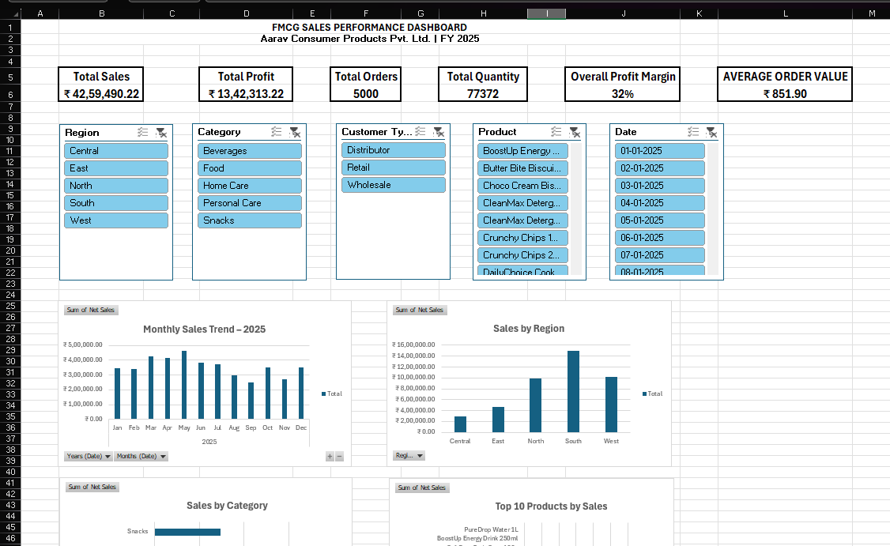

FMCG Sales Performance Dashboard

📊 Project Overview

An interactive FMCG sales analytics dashboard developed using Microsoft Excel to analyze sales performance, profitability, customer segments and regional trends.

The project demonstrates the use of Excel for data cleaning, transformation, analysis, visualization and business decision-making.

Note: The dataset used in this project is simulated and created for educational and portfolio purposes.

---
📊 Dashboard Preview

---

🎯 Business Objectives

* Analyze overall sales and profitability
* Identify high-performing regions
* Compare FMCG categories
* Identify top-selling and profitable products
* Analyze customer-type performance
* Understand monthly sales trends
* Identify opportunities for improving profitability

---

🛠️ Tools & Skills

* Microsoft Excel
* Excel Tables
* Excel Formulas
* Power Query
* PivotTables
* PivotCharts
* Slicers
* Interactive KPI Dashboard
* Data Analysis
* Business Insights
* Business Recommendations

---

📈 Dashboard KPIs

The dashboard tracks:

* Total Sales
* Total Profit
* Total Orders
* Total Quantity
* Profit Margin
* Average Order Value

---

📊 Analysis Performed

### Regional Analysis

Compared sales performance across different regions.

### Product Analysis

Identified top-selling and most profitable products.

### Category Analysis

Compared sales and profitability across FMCG categories.

### Customer Analysis

Compared Distributor, Wholesale and Retail customer performance.

### Monthly Analysis

Analyzed sales trends throughout 2025.

---

💡 Key Business Insights

* South is the leading region by sales in the simulated dataset.
* Home Care is the largest category by sales.
* DailyChoice Cooking Oil 1L is the top-selling product.
* CleanMax Detergent 2kg generates the highest product profit.
* Distributors contribute the highest sales among customer types.
* May records the highest monthly sales.
* High sales volume does not always translate into high profit margins.

---

💼 Business Recommendations

* Evaluate successful practices in the South region for potential application elsewhere.
* Monitor Home Care costs, pricing and product mix to protect margins.
* Review the pricing and cost structure of high-volume, lower-margin products.
* Explore opportunities to expand high-margin products.
* Develop the Retail channel to diversify the customer mix.
* Investigate the factors contributing to May's higher sales.

---

📁 Project Files

| File                                | Description                           |
| ----------------------------------- | ------------------------------------- |
| `FMCG_Sales_Dashboard_Project.xlsx` | Complete Excel dashboard and analysis |
| `FMCG_Sales_Data_5000_Rows.csv`     | Simulated FMCG transaction dataset    |

---

📌 Project Outcome

This project demonstrates how raw sales data can be transformed into an interactive management dashboard and converted into actionable business insights.

**Skills demonstrated:** Excel Analytics • Data Visualization • Business Intelligence • Marketing Analytics • Business Analysis
